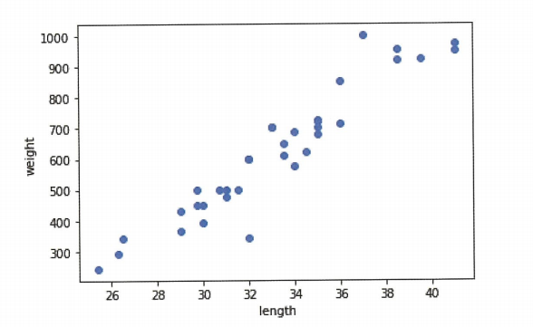
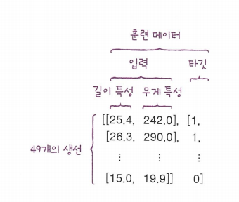
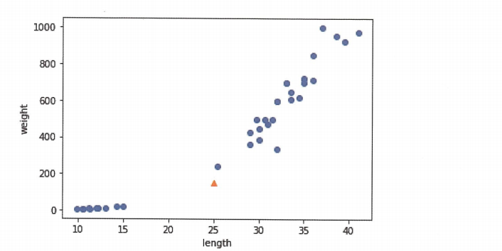
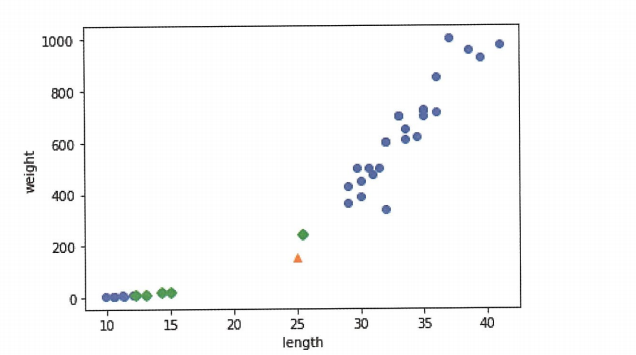

# Chapter 1. 나의 첫 머신러닝
### 인공지능이란?  

- 사람처럼 학습하고 추론할 수 있는 지능을 가진 컴퓨터 시스템을 만드는 기술.   
 ### 머신러닝이란?  
 
 - 규칙을 일일이 프로그래밍하지 않아도 자동으로 데이터에서 규칙을 학습하는 알고리즘을 연구하는 분야.  
 - 머신러닝의 대표적인 라이브러리는 사이킷런(scikit-leanrn)  
 ### 딥러닝이란?  
 - 머신러닝 알고리즘 중에 인공신경망을 기반으로 한 방법들을 통칭하여 딥러닝이라고 부른다.  
 - 텐스플로우(구글) , 파이토치(페이스북)의 오픈소스가 있음  
 ## Chapter 01-2 코랩과 주피터 노트북  
 코랩은 웹 브라우저에서 텍스트와 프로그램 코드를 자유롭게 작성할 수 있는 온라인 에디터라고 생각하면 된다. 

 #### 텍스트 셀에 사용할수 있는 마크다운  

 
 ## Chapter 01-3 마켓과 머신러닝  
 #### 생선 분류 문제  
 - 1.도미 데이터
 ```
 bream_length = [25.4, 26.3, 26.5, 29.0, 29.0, 29.7, 29.7, 30.0, 30.0, 30.7, 31.0, 31.0, 31.5, 32.0, 32.0, 32.0, 33.0, 33.0, 33.5, 33.5, 34.0, 34.0, 34.5, 35.0, 35.0, 35.0, 35.0, 36.0, 36.0, 37.0, 38.5, 38.5, 39.5, 41.0, 41.0]
bream_weight = [242.0, 290.0, 340.0, 363.0, 430.0, 450.0, 500.0, 390.0, 450.0, 500.0, 475.0, 500.0,500.0, 340.0, 600.0, 600.0, 700.0, 700.0, 610.0, 650.0, 575.0, 685.0, 620.0, 680.0,700.0, 725.0, 720.0, 714.0, 850.0, 1000.0, 920.0, 955.0, 925.0, 975.0, 950.0]
```  

- 2.데이터를 산점도를 통해 선형성 확인 
```
import matplotlib.pyplot as plt
plt.scatter(bream_length,bream_weight)
plt.xlabel('length')
plt.ylabel('weight')
plt.show  
```
시각화 결과 


- 3.도미,빙어 같이 산점도 찍기 
```
plt.scatter(bream_length, bream_weight)
plt.scatter(smelt_length, smelt_weight)
plt.xlabel('length')
plt.ylabel('weight')
plt.show()
```
  

- 4.K-NN분석(k-최근접 이웃)

```
### 데이터 전처리 ###
length = bream_length + smelt_length 
weight = bream_weight + smelt_weight 
fish_data =[[l,w] for l , w in zip (length , wieght)]
#리스트  병합 후 세로 방향으로 2차원 리스트 만들기
first_targer = [1]*35 +[0]*14 #정답(라벨링) 리스트 


#### 모델 불러오기  #### 
from sklearn.neighbors import KNeighborsClassifier
model =sklearn.neighbors.KNeighborsClasffier()
kn = KNeighborsClassifier() #default n_neighbor=5
kn.fit(fish_data,fish_target) #타겟변수(종속변수)를 통한 알골리즘 훈련 
kn.score(fish_data,fish_target) #모델 평가 점수(정확도)
kn.predict([[30,600]]) #test data 넣어보기 

kn49=KNeighborsClasffifier(n_neighbors=49) #참고 데이터를 49개로 한 kn49 모델 이는 가장 가까운 데이터 49개를 사용하여 k-NN모델에 fish_data적용 그러면 49개중 도미가 35개 이기에, 무조건 도미를 예측할 것임
kn49.fit(fish_data,fish_target)
kn49.score(fish_data,fish_target) #0,71428

```


# Chapter 2.데이터 다루기   
### 지도학습과 비지도 학습
- 지도학습은 정답(라벨링)이 필요하다.  
- 지도 학습에서는 데이터와 정답을 입력(input)과 타깃(target)이라 함 이를 합쳐서 훈련데이터(training set)이라 부른다.
- Target변수를 제외한 나머지 독립변수들을 특성(Feature)이라한다.  

- 만약 정답이 없으면 비지도 학습 알고리즘을 사용해야한다.  
### 훈련세트와 테스트 세트
- 준비된 데이터 셋을 Test set과 Train set으로 나누어 평가하는 것이 일반적이다. 보통 이미 준비된 데이터 중 일부를 떼어내어 활용한 것을 Test set보다는 Validation set이라고 부르는 것이 일반적 그리고 새로 들어온 데이터를 Test set이라고 부르는 것이 일반적이긴 하다.  

- 1.49개의 샘플 데이터 불러오기 
```
bream_length = [25.4, 26.3, 26.5, 29.0, 29.0, 29.7, 29.7, 30.0, 30.0, 30.7, 31.0, 31.0, 31.5, 32.0, 32.0, 32.0, 33.0, 33.0, 33.5, 33.5, 34.0, 34.0, 34.5, 35.0, 35.0, 35.0, 35.0, 36.0, 36.0, 37.0, 38.5, 38.5, 39.5, 41.0, 41.0]

bream_weight = [242.0, 290.0, 340.0, 363.0, 430.0, 450.0, 500.0, 390.0, 450.0, 500.0, 475.0, 500.0, 500.0, 340.0, 600.0, 600.0, 700.0, 700.0, 610.0, 650.0, 575.0, 685.0, 620.0, 680.0, 700.0, 725.0, 720.0, 714.0, 850.0, 1000.0, 920.0, 955.0, 925.0, 975.0, 950.0]
fish_data = [[l,w]] for l,w in zip(fish_length,fish_weight)]
fish_target = [1]*35 + [0]*14 
```
- 2.불러온 데이터를 약 7:3으로 trainset과 validation set으로 나누기
```
from sklearn.neighbors import KNeighborsClassifier
kn = KNeighborsClassifier()
#slicing을 통한 데이터셋 분리 
train_input = fish_data[:35]
train_target = fish_data[:35]
test_input = fish_data[35:]
test_target = fish_target[35:]
```
- 3.모델 평가
```
kn = kn.fit(train_input,train_target)
kn.score(test_input,test_target)# 결과 0.0
```
- ramdomsample해야 결과 0.0이 사라짐 
sampling bias(샘플링 편향)을 없애기 위해 numpy를 활용하여 데이터 셋을 섞어야 한다. 


```
import numpy as np 
input_arr = np.array(fish_data)
target_arr = np.array(fish_target)
```
항상 인덱스를 기억할 수 없으니 index를 만든 후 shuffle 해야한다.
```
np.random.seed(123)
index=np.arange(49)
np.random.shuffle(index)
```
이를 활용하여 input과 target 섞기
```
train_input=input_arr[index[:35]]
train_target=target_arr[index[:35]]

test_input = input_arr[index[35:]]
test_target = target_arr[index[35:]]
```
- 산점도로 잘 섞였는지 시각화  
```
import matploylib.pyploy as plt 
plt.scatter(train_input[:,0],train_input[:,1])
plt.scatter(test_input[:,0],test_input[:,1])
plt.xlabel('length')
plt.ylabel ('weight)
plt.show()
```

결과를 보면 train_set과 test_set이 잘 mix된 것을 알 수 있다.
- randomsampling 후 KNN모델 이용  
```
kn=kn.fit(train_input,train_target)
kn.score(test_input,test_target)
kn.predict(test_input)
test_target #결과 accuarcy=1
```
### 데이터 전처리  
- 올바른 결과 도출을 위해서 데이터를 사용하기 전에 데이터 전처리 과정을 거친다. 전처리 과정을 거친 데이터로 훈련했을 때의 차이를 알고 표준점수로 특성의 스케일을 변환하는 방법을 배운다.
```
### 데이터 셋 불러오기 
fish_length = [25.4, 26.3, 26.5, 29.0, 29.0, 29.7, 29.7, 30.0, 30.0, 30.7, 31.0, 31.0, 31.5, 32.0, 32.0, 32.0, 33.0, 33.0, 33.5, 33.5, 34.0, 34.0, 34.5, 35.0, 35.0, 35.0, 35.0, 36.0, 36.0, 37.0, 38.5, 38.5, 39.5, 41.0, 41.0, 9.8, 10.5, 10.6, 11.0, 11.2, 11.3, 11.8, 11.8, 12.0, 12.2, 12.4, 13.0, 14.3, 15.0]
fish_weight = [242.0, 290.0, 340.0, 363.0, 430.0, 450.0, 500.0, 390.0, 450.0, 500.0, 475.0, 500.0, 500.0, 340.0, 600.0, 600.0, 700.0, 700.0, 610.0, 650.0, 575.0, 685.0, 620.0, 680.0, 700.0, 725.0, 720.0, 714.0, 850.0, 1000.0, 920.0, 955.0, 925.0, 975.0, 950.0, 6.7, 7.5, 7.0, 9.7, 9.8, 8.7, 10.0, 9.9, 9.8, 12.2, 13.4, 12.2, 19.7, 19.9]
```
#### Numpy를 활용한 데이터 전처리 
```
np.column_stack(([1,2,3],[4,5,6]))
#결과는 처음 리스트와 두번째 리스트의 원소의 위치에 알맞게 바뀌어 2차원 배열이 3*2의 행렬로 반환됨. 두 행을 붙인다고 생각하면 편함
fish_data=np.column_stack((fish_length,fish_weight)) 
```
- 행으로 연결시키면 column_stack() ,열로 연결시키면 concatenate()


#### sklearn을 활용한 Ramdomsampleing
편리하게 train_set과 test_set을 나눌 수 있는 메소드 이용  
```
from sklearn.model_selection import train_test_split

train_input,test_input,train_target,test_target = train_test_split(fish_data,fish_target,ramdom_state=42) #ramdom sampling 이때 매개변수 ramdom_state하면 랜덤으로 데이터셋이 섞임 
```

-train,test에 대한 shape 보기 
```
print(train_input.shape, test_input.shape) 
```
```
(36,2) (13,2)  #결과는 36*2 ,13*2 행렬을 의미 
```
#### 문제발생: 도미와 빙어를 ramdom sampling 했지만, Sampling bias가 나타남.   
-해결 방법은 train_test_split method에서 stratify 매개변수 사용할 것 !
```
train_input,test_input,train_target,test_target = train_test_split(fish_data,fish_target,stratify=fish_target,ramdom_state=42) #완벽히 5:5는  아니지만, 꽤 비슷한 비율로 맞출 수 있었음 
```

- 전처리한 데이터를 바탕으로 K-NN 모델 이용  
```
from sklearn.neighbors import KNeighborsClassifier 
kn= KNeighborsClassifier()
kn.fit(train_input,train_target)
kn.score(test_input,test_target)
#결과: 1.0
```

```
print(kn.predict([[25,150]]))
= [0.] #결과가 틀리는 문제가 발생 
```
- 문제가 발생했기에, scatter를 그려봄 
```
import matplotlib.pyplot as plt 
plt.scatter(train_input[:,0],train_input[:,1])
plt.scatter(25,150,marker='^') #marker 매개변수는 모양을 지정하는 것임
plt.xlabel('length')
plt.ylabel('weight')
plt.show()
```

- 산점도를 확인한 결과 KNeighborsClassifier 클래스는 주어진 샘플 중에서 가장 가까운 이웃을 찾아준다. 따라서 기본 Default n_neighbors=5이기 때문에 5개의 이웃이 반환 됨. 
- 그러면 가장 가까운 5개를 알 수 있는 방법은 뭐가 있을까? 이 또한 산점도를 이용한다
```
plt.scatter(train_input[:,0],train_input[:,1])
plt.scatter(25,150,marker='^')
plt.scatter(train_input[indexes,0],train_input[indexes,1],marker='D')
plt.xlabel('length')
plt.ylabel('weight')
```

- 시각화를 해서 [25,150]의 NN 5개를 확인 할 수 있었음

- 문제 해결 방법: 거리 확인한 후 모델 조정  
- 산점도에서 x,y축 범위 동일하게 조정
```
plt.scatter(train_input[:,0],train_input[:,1])
plt.scatter(25,150,marker='^')
plt.scatter(train_input[indexes,0],train_input[indexes,1],marker='D')
plt.xlim((0,1000))
plt.xlabel('length')
plt.ylabel('weight')
plt.show()
````


결과를 확인해보니, 생선의 길이 보다는 생선의 무게만이 고려의 대상이 된다.  
즉, 두 특성의 스케일이 다름을 알 수 있다. 데이터를 표현하는 기준이 다르면 알고리즘이 올바르게 예측할 수 없다. 알고리즘이 거리 기반일 때 더욱 그렇다. 따라서 데이터 Scaling이 필요하다.

#### z-score(표준점수) 사용하여 전처리 
```
mean=np.mean(train_input,axis=0)
std=np.std(train_input,axis=0)
train_scaled = (train_input - mean)/std
```


- 다시 산점도 그려보기
```
plt.scatter(train_scaled[:,0],train_scaled[:,1])
plt.scatter(25,150,marker='^')
plt.xlabel('length')
plt.ylabel('weight')
plt.show()
```

- 산점도를 그려본 결과, 왼쪽에 편향되어 있음.또한 오른쪽 맨 위에 샘플[20,150]이 있음. 이를 해결하기 위해 똑같이 test sample도 표준화 시켜야함.

```
new=([25,150]-mean)/std
plt.scatter(train_scaled[:,0],train_scaled[:,1])
plt.scatter(new[0],new[1],marker='^')
plt.xlabel('length')
plt.yalbel('weight')
plt.show()
```

- 산점도 결과  x,y축이 scaling 됨.  
이를 통해서 다시 k-nn 모델 훈련

```
kn.fit(train_scaled,train_target) #모델 훈련 
test_scaled=(test_input-mean)/std #테스트 셋 스케일링
kn.score(test_scaled,test_target) #모델 평가 
=1.0 #결과 

print(kn.predict([new])) #결과 [1.]
```
**데이터 스케일링**이 모델의 성능을 좋게 할 수도 있다는 인사이트를 얻음. 


