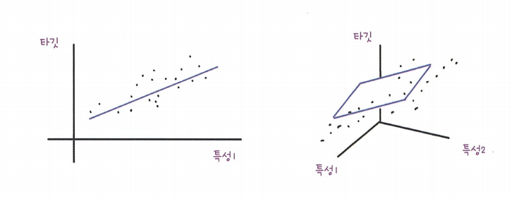
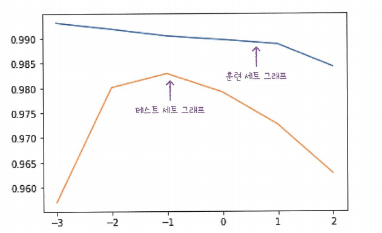
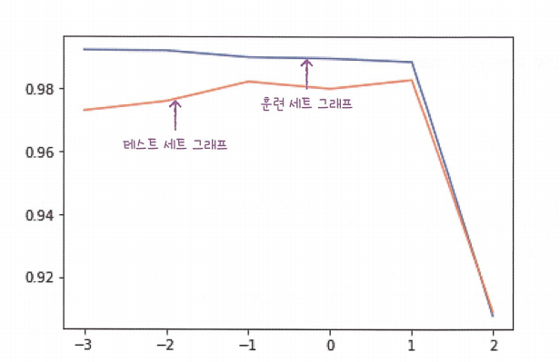

# Chapter3. 회귀 알고리즘과 모델 규제  

## k-최근접 이웃 회귀
지도학습(Supervised Learning)은 분류(Classification)와 회귀(Regression)로 나뉜다.
**`k-최근접 이웃 분류 알고리즘`**은 가까운 샘플 k개를 선택하여 새로운 샘플의 **클래스**를 예측함.  
**`k-최근접 이웃 회귀`**는 회귀이기 떄문에 이웃한 샘플의 타깃이 어떤 클래스가 아니라 **수치**를 예측함. 
#### 1.데이터셋 불러오기
```
perch_length = np.array([8.4, 13.7, 15.0, 16.2, 17.4, 18.0, 18.7, 19.0, 19.6, 20.0, 21.0, 21.0, 21.0, 21.3, 22.0, 22.0, 22.0, 22.0, 22.0, 22.5, 22.5, 22.7, 23.0, 23.5, 24.0, 24.0, 24.6, 25.0, 25.6, 26.5, 27.3, 27.5, 27.5, 27.5, 28.0, 28.7, 30.0, 32.8, 34.5, 35.0, 36.5, 36.0, 37.0, 37.0, 39.0, 39.0, 39.0, 40.0, 40.0, 40.0, 40.0, 42.0, 43.0, 43.0, 43.5, 44.0])
perch_weight = np.array([5.9, 32.0, 40.0, 51.5, 70.0, 100.0, 78.0, 80.0, 85.0, 85.0, 110.0, 115.0, 125.0, 130.0, 120.0, 120.0, 130.0, 135.0, 110.0, 130.0, 150.0, 145.0, 150.0, 170.0, 225.0, 145.0, 188.0, 180.0, 197.0, 218.0, 300.0, 260.0, 265.0, 250.0, 250.0, 300.0, 320.0, 514.0, 556.0, 840.0, 685.0, 700.0, 700.0, 690.0, 900.0, 650.0, 820.0, 850.0, 900.0, 1015.0, 820.0, 1100.0, 1000.0, 1100.0, 1000.0, 1000.0])
```

#### 2.산점도 그리기
```
import matplotlib.pyplot. as plt
plt.scatter(perch_length,perch_weight)
plt.xlabel('length')
plt.ylabel('weight')
plt.show()
```


#### 3.trainset과 validationset 나누기
```
from sklearn.model_selection import train_test_split
train_input, test_input,train_target,test_target = train_test_split(perch_length,perch_weight,random_state=42)
test_array = test_array.reshape(2,2) #(2,2)행렬로 변환 
print(test_array.shape)
```
- **사이킷런에 사용할 훈련 세트는 2차원 배열이어야 한다.**


Numpy는 배열의 크기를 자동으로 지정하는 기능을 제공함. 크기에 -1을 지정하면 나머지 원소 개수로 모두 채우라는 의미이다.
```
train_input = train_input.reshape(-1,1)
test_input = test_input.reshape(-1,1)
print(train_input.shape,test_input.shape)
```
### 결정계수($R^2$)
회귀에서 정답을 맞힌 개수의 비율을 결정계수(cofficient of determination)이라고 부른다 이를 $R^2$이라한다. 
$R^2 =1-(타깃-예측)^2/(타깃-평균)^2$
```
from skleanr.neighbors import KNeighborsRregressor
knr=KNeighborsRegressor()
knr.fit(train_input,train_target)
print(knr.score(test_input,test_target)) #knr에서 scoresms 결정계수임 
```
```
> 0.9928094061010639
```
MAE(절댓값 오차 평균)구하기
```
from skleanr.metircs import mean_absolute_error
test_prediction = knr.predict(test_input)
mae=mean_absolute_error(test_target,test_prediction)
print(mae)
```
```
> 19.157142857142862
```

### 과대적합 vs 과소적합
**과대적합**은 훈련 세트에서 점수가 굉장히 좋았는데 테스트 세트에서 점수가 나쁜 모델  
**과소적합**은 훈련세트보다 테스트 세트의 점수가 높거나 두 점수 모두 낮은 모델  
```
print(knr.score(train_input,train_target)
```
```
> 0.9698823289099255
```
- 현재 과소적합이기 때문에, 이를 해결해야함. 해결 방법은 k의 개수를 줄여서 모델을 복잡하게 만들 수 있다. 이웃의 개수를 줄이면 훈련 세트에 있는 국지적인 패턴이 민감해지고, 이웃의 개수를 늘리면 데이터 전반에 있는 일반적인 패턴을 따를 것이다.

```
knr.n_neighbors = 3
knr.fit(train_input,train_target)
print(knr.score(train_input,train_target))
```
```
>0.974645996398761 #결과가 과소적합 해결함. 
```

## 선형회귀 
k-최근접 이웃의 한계를 풀어보자.
### 데이터 불러오기 및 전처리 
```
import numpy as np
from sklean.model_selection import train_test_split 
from skleanr.neighbors improt KNeighborsRegressor
#데이터 불러오기 
perch_length = np.array([8.4, 13.7, 15.0, 16.2, 17.4, 18.0, 18.7, 19.0, 19.6, 20.0, 21.0, 21.0, 21.0, 21.3, 22.0, 22.0, 22.0, 22.0, 22.0, 22.5, 22.5, 22.7, 23.0, 23.5, 24.0, 24.0, 24.6, 25.0, 25.6, 26.5, 27.3, 27.5, 27.5, 27.5, 28.0, 28.7, 30.0, 32.8, 34.5, 35.0, 36.5, 36.0, 37.0, 37.0, 39.0, 39.0, 39.0, 40.0, 40.0, 40.0, 40.0, 42.0, 43.0, 43.0, 43.5, 44.0])
perch_weight = np.array([5.9, 32.0, 40.0, 51.5, 70.0, 100.0, 78.0, 80.0, 85.0, 85.0, 110.0, 115.0, 125.0, 130.0, 120.0, 120.0, 130.0, 135.0, 110.0, 130.0, 150.0, 145.0, 150.0, 170.0, 225.0, 145.0, 188.0, 180.0, 197.0, 218.0, 300.0, 260.0, 265.0, 250.0, 250.0, 300.0, 320.0, 514.0, 556.0, 840.0, 685.0, 700.0, 700.0, 690.0, 900.0, 650.0, 820.0, 850.0, 900.0, 1015.0, 820.0, 1100.0, 1000.0, 1100.0, 1000.0, 1000.0])

#2차원 배열로 바꾸기
train_input,test_input,train_target,test_target = train_test_split(perch_length,perch_weight,random_state=42)
train_input = train_input.reshape(-1,1)
test_input = test_input.reshape(-1,1)

#모델 학습
knr = KNeighborsRegressor(n_neighbors=3)
knr.fit(train_input,train_target)
print(knr.predict([[50]]))
```
```
> 1033.3333333
```
50cm의 농어무게는 1,033g보다 훨씬 많이 나감. 이 문제를 선형회귀로 지금부터 풀 것임. 일단 산점도부터 그려보자

```
import matplotlib.pyplot as plt 
distances,indexes = knr.kneighbors([[50]]) #50cm 농어의 이웃을 구한다
plt.scatter(train_input,train_target) #훈련 세트의 산점도를 그린다
plt.scatter(train_input[indexes],train_target[indexes],marker='D')#훈련 세트 중에서 이웃 샘플만 다시 그림
plt.scatter(50,1033,marker='^')
plt.show()
```

k-nn에서 문제는 50cm 농에서 가장 가까운 것은 45cm근방이기 때문에 k-nn알고리즘은 이 샘플들의 평균을 구했다. 
```
print(np.mean(train_target[indexes]))
```
```
>1033.33333333
```
산점도를 그려서 확인해보기
```
distasnces,indexes = knr.kneighbors([[100]])
plt.scatter(train_input,train_target)
plt.scatter(train_input[indexes],train_target[indexes],marker='D')
plt.scatter(100,1033,marker='^')
plt.show()
```

knn 알고리즘의 한계 직면! 다른 알고리즘으로 풀어야할 것   
**머신러닝 모델은 한 번 만들고 끝나는 프로그램이 아니다. 시간과 환경이 변화하면서 데이터도 바뀌기 때문에 주기적으로 새로운 훈련 데이터로 모델을 다시 훈련시켜야 한다. 예를들어 배달음식이 도착하는 시간을 예측하는 모델은 배달원이 바뀌거나 도로 환경이 변할 수 있기 때문에 새로운 데이터를 사용해 반복적으로 훈련해야 한다.**

### 선형회귀 

```
from skleanr.linear_model import LinearRegression
lr=LinearRegression()
lr.fit(train_input,train_target) #선형회귀 모델 훈련 
print(lr.predict[[50]])#50cm 농어에 대한 예측
```
```
> [1241.83860323]
```


coef,intercept보는 코드 
```
print(lr.coef_,lr.intercept_)
```
```
> [39.01714496] -709.0186449535477
```
**coef_와intercept_를 머신러닝 알고리즘이 찾은 값이라는 의미로 모델 파라미터(model parameter)라고 부른다.**  

산점도 그려보기
```
plt.scatter(train_input,train_target)
plt.plot([15,50],[15*lr.coef_+lr.intercept_,50*lr.coef_+lr.intercept_])
plt.scatter(50,1241.8,marker='^')
plt.show()
```


$R^2$ 확인
```
print(lr.score(train_input,train_target)) #훈련 세트 
print(lr.score(test_input,test_target)) #테스트 세트
```
```
>0.9398463339976039
>0.8247503123313558
```

### 다항회귀 
- 농어의 길이와 무게에 대한 산점도를 자세히 보면 일직선이라기 보다는 왼쪽으로 조금 구부러진 곡선에 가깝다. 

농어의 길이를 제곱해서 원래 데이터 앞에 붙여야된다.
```
train_poly=np.column_stack((train_input**2,train_input))
test_poly =np.column_stack((test_input**2,test_input))
print(train_poly.shape,test_poly.shape)
```
```
> (42,2) (14,2)
```
-이 데이터를 통해 다시 모델 훈련
```
lr =LinearRregression()
lr.fit(train_poly,train_target)
print(lr.predict([[50**2,50]])
```
```
> [1573.98423528]
```
```
print(lr.coef_,lr.intercept_)
```
```
[1.01433211 -21.55792498] 116.0502107827827
```
이 결과가 뜻하는 것은 

이런 방정식을 다항식이라 부르며 다항식을 사용한 선형 회귀를 **다항회귀**라고 부른다.

- 산점도 그려보기 
```
point=np.arange(15,50)
plt.scatter(train_input,train_target)
plt.plot(point,1.01*point**2 -21.6*point+116.05)
plt.scatter([50],[1574],marker='^')
plt.show()
```


- 모델 평가
```
print(lr.score(train_poly,train_target))
print(lr.score(test_poly,test_target))
```
```
>0.9706807451768623
0.9775935108325122
```
결과를 보면 훈련셋,테스트 셋에 대한 점수가 높아짐 그러나, 여전히 과소적합이 남아있다. 더 복잡한 모델이 필요. 

### 특성 공학과 규제 
**특성공학**이란 기존의 특성을 사용해 새로운 특성을 뽑아내는 작업이다.  
예를 들면, $농어길이*농어높이$와 같이 새로운 특성을 만듦. 사이킷런을 사용하면 쉽게 할 수 있음. 
#### 다중회귀
다중회귀란 여러 개의 특성을 사용한 선형 회귀 모델이다.

단순회귀모델은 직선이고 2개면 평면을 학습한다.  
- 오른쪽과 같이 특성이 2개면 타깃값과 함께 3차원 공간을 형성하고 선형 회귀 방정식 $타깃=a*특성1+b*특성2+절편$이 된다.

#### 1.Pandas를 활용한 데이터 준비

-다음과 같은 과정을 통해 데이터를 처리한다. 

```
import pandas as pd
import numpy as np
df = pd.read_csv('https://bit.ly/perch_csv')
perch_full=df.to_numpy()
print(perch_full)
perch_weight = np.array([5.9, 32.0, 40.0, 51.5, 70.0, 100.0, 78.0, 80.0, 85.0, 85.0, 110.0, 115.0, 125.0, 130.0, 120.0, 120.0, 130.0, 135.0, 110.0, 130.0, 150.0, 145.0, 150.0, 170.0, 225.0, 145.0, 188.0, 180.0, 197.0,218.0, 300.0, 260.0, 265.0, 250.0, 250.0, 300.0, 320.0, 514.0, 556.0, 840.0, 685.0, 700.0, 700.0, 690.0, 900.0, 650.0, 820.0, 850.0, 900.0, 1015.0, 820.0, 1100.0, 1000.0, 1100.0, 1000.0, 1000.0])
```
#### 2.훈련 데이터셋과 테스트 셋으로 나누기
```
from sklearn.model_selection import train_test_split
train_input,test_input,train_target,test_target = train_test_split(perch_full,perch_weight,random_state=42)
```

### 사이킷런의 변환기
사이킷런은 특성을 만들거나 전처리하기 위한 다양한 클래스를 제공한다. 사이킷런에서는 이런 클래스를 **변환기**라고 부른다. 사이킷런의 모델 클래스에 일관된 fit() , score() , predict() 메서드가 있는 것처럼 변환기 클래스는 모두 fit(),trainsform()메서드를 제공한다.
```
from sklearn.preprocessing import PolynomialFeatures
poly = PolynomialFeatures()
poly.fit([[2,3]])
print(poly.transform([[2,3]]))
```
```
> [[1. 2. 3. 4. 6. 9.]]
```
>**transform전에 꼭 poly.fit을 사용해야 하나요?**  
>훈련(fit)을 해야 변환(transform)이 가능하다. 두 메서드를 하나로 붙은 fit_transform 메서드도 있음!  

변환기는 입력 데이터를 변환하는 데 타깃 데이터가 필요하지 않다. 따라서 모델 클래스와는 다르게 fit()메서드에 입력 데이터만 전달했다. 즉 여기에서는 2개의 특성(원소)을 가진 샘플[2,3]이 6개의 특성을 가진 샘플 [1. 2. 3. 4. 6. 9.]로 바뀌었다. 즉 6개의 특성으로 $2*3$되었다.  
**사이킷런의 선형 모델은 자동으로 절편을 추가함.**
즉, include_bias=False를 지정하지 않아도 됨.
```
poly = PolynomialFeatures(include_bias=False) #절편을 위한 항이 제거되고 특성의 제곱과 특성끼리 곱한 항만 추가 됨.
poly.fit([[2,3]])
print(poly.transform([[2,3]])) 
```
```
> [[2. 3. 4. 6. 9.]]
```
- 이 방식을 train_input에 적용
```
poly=PolynomialFeatures(include_bias=False)
poly.fit(train_input)
train_poly=poly.transform(train_input)
print(train_poly.shape)
```
```
> (42,9) #이 결과는 9개의 특성이 만들어짐
```
```
poly.get_features_names() #9개의 특성이 각각 어떤 입력의 조합으로 만들어졌는지 알 수 있음
```
```
> ['x0','x1','x2','x0^2','x0x1','x0x2','x1^2','x1x2','x2^2]
```
```
test_poly = poly.transform(test_input)
#테스트 셋 변환
```
### 다중 회귀 모델 훈련하기
```
from sklearn.linear_model import LinearRegression
lr = LinearRegression()
lr.fit(train_poly,train_target)
print(lr.score(train_poly,train_target))
```
```
> 0.9903183436982124
```
```
print(lr.score(test_poly,test_target))
```
```
> 0.9714559911594134
```

- 3제곱,4제곱등은 PolynomialFeatures클래스의 degree 매개변수를 추가해서 가능
```
poly= PolynomialFeatures(degree=5,include_bias=False)
poly.fit(train_input)
train_poly = poly.transform(train_input)
test_poly = polt.transform(test_input)
print(train_poly.shape)
```
이를 활용하여 선형 회귀 모델을 다시 훈련시킴.

```
lr.fit(train_poly,train_target)
print(lr.score(train_poly,train_target))
```
```
> 0.999999999
```
```
print(lr.score(test_poly,test_target))
```
```
> -144.40579242684848
```
특성의 개수를 늘리면 선형 모델은 강력해짐. 그러나, 과적합이 일어남으로 테스트 셋에서 형편없는 점수가 나옴.


### 규제
**규제**는 머신러닝 모델이 훈련 세트를 과도하게 학습하지 못하도록 훼방하는 것을 말한다. 선형회귀 모델의 경우 특성에 곱해주는 계수의 크기를 작게 만드는 일이다.

- 규제를 통해서 훈련 세트의 점수를 낮추고 테스트 세트의 점수를 높일 수 있음
선형 회귀 모델에 규제를 추가한 모델을 릿지(ridge)와 라쏘(lasso)라고 부른다. 
-릿지(ridge)는 계수를 제곱한 값을 기준으로 규제 를 적용 함
-라쏘(lasso)는 계수의 절댓값ㅇ르 기준으로 규제를 적용함.  
**일반적으로 릿지를 더욱 선호함** 이유는 라쏘는 계수의 크기를 아예 0으로 만들 수 있기 때문이다. 
- 특성간에 스케일이 다르기 때문에 정규화를 먼저 해야함

```
from sklearn.preprocessing import StandardScaler
ss=StandardScaler()
ss.fit(train_poly)
train_scaled = ss.transform(train_poly)
train_scaled = ss.transform(test_poly)
```
이제 표준 점수로 변환한 train_scaled와 test_scaled가 준비 됨. 

### 릿지 회귀 
```
from sklearn.linear_model import Ridge
ridge=Ridge()
ridge.fit(train_scaled,train_target)
print(ridge.score(train_scaled,train_target))
```
```
> 0.9896101671037343
```
print(ridge.score(test_scaled,test_target))
```
```
> 0.9790693977615398
테스트 세트 점수가 정상으로 돌아옴. 확실히 많은 특성을 사용했음에도 과적합이 일어나지 않음. 
- 릿지,라쏘 모델을 사용할때 매개변수 alpha를 사용할 수 있음. alpha가 커지면 규제 강도가 세지고 계수 값이 줄어들어 조금 과소적합을 유도함.  
-그러면 적절한 alpha값은 어떻게 얻을 수 있을까?   $R^2$을 그래프로 그려보는 것이다. 

```import matploylib.pyplot as plt 
train_score = []
test_score = []
alpha_list = [0.001,0.01,0.1,1,10,100]
for alpha in alpha_list:
ridge = Ridge(alpha=alpha)
ridge.fit(train_scaled,train_target)
train_score.append(ridge.score(train_scaled,train_target))
test_score.appendridge.score(test_scaled,test_target)
```
이를 그래프로 그리면 왼쪽이 너무 촘촘하기 때문에, 로그함수로 바꿔 표현
```
plt.plot(np.log10(alpha_list),train_score)
plt.plot(np.log10(alpha_list),test_score)
plt.show()
```

결과를 해석하지면, 테스트 셋 그래프가 -1이후에 성능이 않좋아진다. 따라서 적절한 alpha값은 -1 , 즉 0.1이다. 

```
ridge=Ridge(alpha=0.1)
ridge.fit(train_scaled,train_target)
print(ridge.score(train_scaled,train_target))
print(ridge.score(test_scaled,test_target))
```
```
> 0.9903815817570366
> 0.9827976465386926
```
최종 결과는 훈련 세트와 테스트 셋의 점수가 비슷하게 모두 높고 과적합,과소적합 균형을 맞추고 있다. 

### 라쏘 회귀

```
from sklearn.linear_modle import Lasso
lasso = Lasso()
lasso.fit(train_scaled,train_target)
print(lasso.score(train_scaled,train_target))
```
```
> 0.9897898972080961
```
```
print(lasso.score(test_scaled,test_target))
```
```
> 0.9800593698421883
```
-alpha값 바꿔서 릿지와 똑같이 수행 
```
train_score = []
test_score = []
alpha_list = [0.001,0.01,0.1,1,10,100]
for alpha in alpha_list:
lasso = Lasso(alpha=alpha,max_iter=10000)
lasso.fit(train_scaled,train_target)
train_score.append(lasso.score(train_scaled,train_target))
test_score.append(lasso.score(test_scaled,test_target))
```
- plt 그리기
```
plt.plot(np.log10(alpha_list),train_score)
plt.plot(np.log10(alpha_list),test_score)
plt.show()
```

- 라쏘 모델에서 최적의 alpha 값은 1 즉 10이다. 이 값으로 다시 훈련

```
lasso = Lasso(alpha=10)
lasso.fit(train_scaled,train_target)
print(lasso.score(train_scaled,train_target))
print(lasso.score(test_scaled,test_target))
```
```
> 0.9888067471131867
> 0.9824470598706695
```
-coef_속성이 0인 것 
```
print(np.sum(lasso.coef_ ==0))
```
```
> 40
```